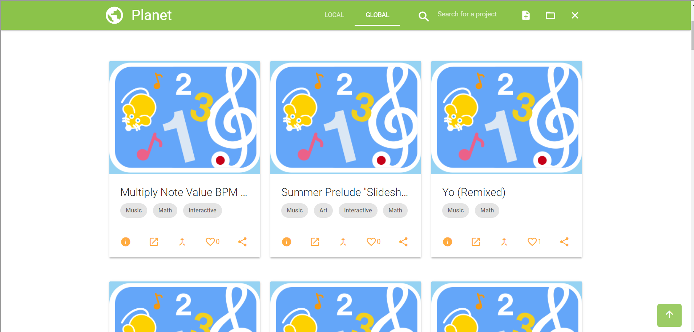

# Introduction

Music Blocks is a _Visual Programming Language_ and collection of
_manipulative tools_ for exploring musical and mathematical concepts
in an integrative and entertaining way.

“Music is the arithmetic of sounds as optics is the geometry of light.” — Claude Debussy 

“Mathematics and music are in a sense the same thing, with a different application.” — Roger Sessions

## Music Blocks 

Visit the Music Blocks website for a hands-on experience:
[https://musicblocks.sugarlabs.org](https://musicblocks.sugarlabs.org).

Or download Music Blocks from the [Google Play Store](https://play.google.com/store/apps/details?id=my.musicblock.sugarlab)

Additional background on why we combine music and programming can be found
[here](./WhyMusicBlocks.md).

## Getting Started with Music Blocks Lesson Plan Generator 

There are several projects in Music Blocks, but only some of them have lesson plans. Additionally, only some of the concepts have lesson plans. In this project, we aim to create a chatbot that can generate lesson plans and answer your questions about Music Blocks.

Projects in Music Blocks - 



## Setting Project locally

1. Clone the Music Blocks repository to your local machine:

  ```bash
  git clone https://github.com/khadar1020/Musicblocks-AI.git
  ```

2. Navigate to the cloned repository:

 ```bash
 cd Musicblocks-AI
 ```
3. Install Ollama locally on your PC

   Link to the website - [https://ollama.com/](https://ollama.com/).
4. Install llama3 on your PC using ollama and terminal

  ```bash
  ollama pull llama3
  ```
5. Checking whether llama3 is installed or not
   
  ```bash
  ollama run llama3
  ```
6. Then install all the requirements for the project
   
  ```bash
  pip install -r requirements.txt
  ```
7. Then run this command to create a vector database this will take time 
  ```bash
  python ingest.py
  ```
8. Then run this final command to run the project locally on your PC 
  ```bash
  chainlit run model.py -w
  ```   
    

## License

Music Blocks AI is licensed under the [AGPL](https://www.gnu.org/licenses/agpl-3.0.en.html)
