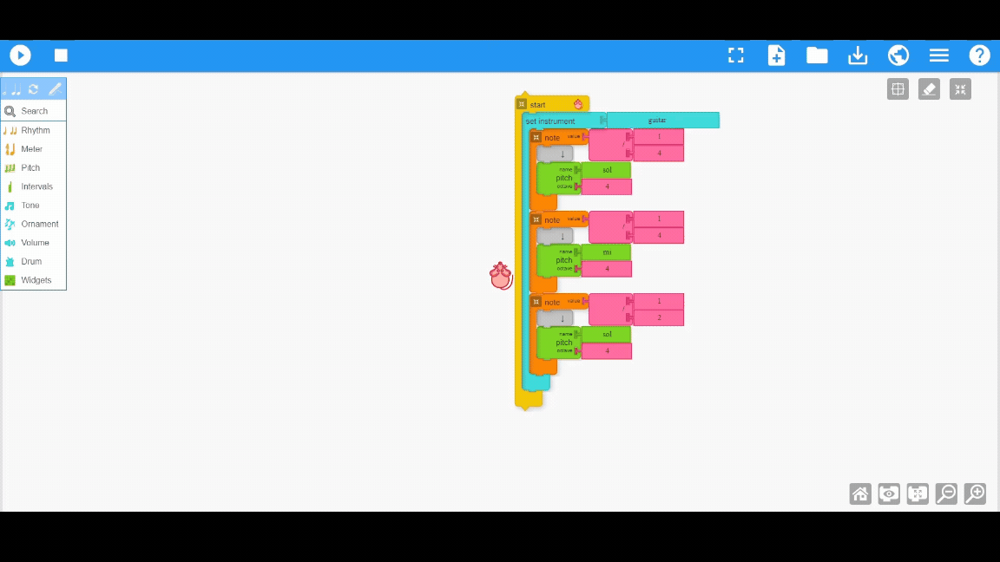

# 🎵🎹 Welcome to Music Blocks Lesson Plan Generator Bot 

Hi there, 👋 We're super excited to have you on board! 🎉 Let's dive into the magical world of music and learning together. 🎶✨

## Note - Don't try to ask any unnecassary questions. Try to ask only Music Blocks questions.

## 🤖 what are the functionalities of our chatbot❓

##### 1. you can ask any questions related to the Music Blocks Ex-(How chords are used in Music Blocks?)
##### 2. you can generate lesson plans of a topic. 

## 🎯 Points to be remembered to while generating a lesson plan for a topic

##### 1. When the user asks to generate the lesson plan the Music Blocks AI will provide you with 6 songs and why they are best suit for that topic choose one of the song based on the index of the song.

##### 2. Then the model will generate a lesson plan for that topic based on that song. 

##### 3. The lesson plan may have some inaccuracies since it is AI-generated, so please check it once it is generated.

# What is midi file and How can we use it in Music Blocks? 
✨ Midi Files - MIDI files are digital music files that store information about notes, timing, and instruments, allowing electronic devices to play music. They don't contain actual sound but instructions for generating sound. In the lesson plan I have added these midi files of the song that user selected. User can directly upload this into Music Blocks and it works like a magic and it gets all the blocks which are used in Music Blocks and arrange them to get the melody.

# How to upload a midi file in music blocks?
1. Download the midi file from the link provided in the lesson plan.
2. There are 2 ways to upload this midi file into the music blocks.

    a. Drag and drop the midi file into the music blocks.

    b. Go to the upload file of the music blocks and select the midi file and click upload.

Here is the GIF how you can upload the midi file in the Music Blocks 

